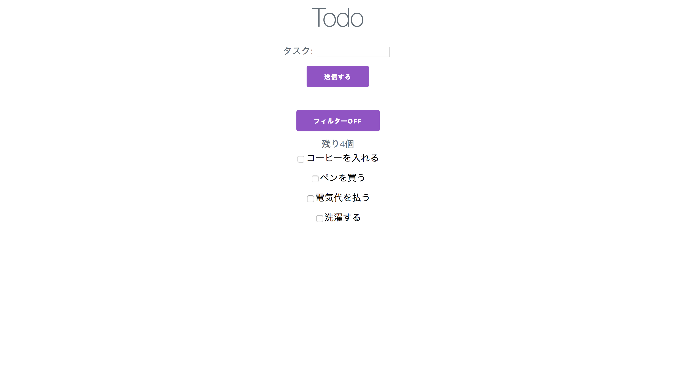

# HELL_todo_jquery

React ハンズオンの教材コード

地獄のような jQuery (昔の自分のコードです)



## 環境

サーバー: https://github.com/sadnessOjisan/JSON-Now

```
$ git clone https://github.com/sadnessOjisan/JSON-Now.git

$ yarn run start
```

フロントエンドは、このレポジトリの`index.html`を開けば OK です。

## 機能

- todo をサーバーから取得し、表示する機能
- todo をサーバーに投稿する機能
- todo の達成をチェックする機能し、サーバーを更新する機能
- 達成している todo の見栄えを変える機能
- 残っている todo のみにフィルタリングをかける機能
- 残り todo 数をカウントする機能

## 技術スタック

- JS(ES5)
- jQuery
- milligram(CSSFW)
